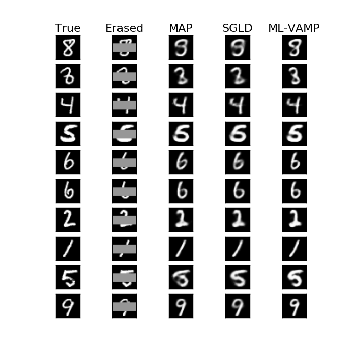

# ML-VAMP based Inference in Multi-Layer Perceptron

Multi-layer perceptrons (MLPs) and deep neural networks are increasingly used
as generative priors for complex data such as images and text.  These models
can be used for reconstruction and inverse problems in a three step procedure:
* *Train an MLP model for the data*:
A generative MLP model for data is first trained
from examples.  In the generative MLP model, the data (such as an image)
is represented as the output of a feedforward MLP with randomness
at the input.  
* *Modeling the measurements*:  Layers are then be added to the MLP 
to model the the measurements (such as blurring, occlusion and noise).  
* *Inference for reconstruction*:  Given a new measured data example
(e.g. an occluded image), 
the original data (e.g. full image)
can be estimated by inferring the input and hidden states of the MLP
from the output measurements.

The ML-VAMP algorithm provides a computationally fast
method for performing the final inference step in the above sequence.
Importantly, the algorithm offers provable guarantees in certain high-dimensional random
instances.  The algorithm was first presented in the paper,
> A.K.Fletcher, S.Rangan, "Inference in Deep Networks in High Dimensions", 
[arxiv preprint 1706.06549](https://arxiv.org/abs/1706.06549), June 2017.

The programs in this directory demonstrate and evaluate
the ML-VAMP based inference and 
reproduce results similar to the above paper.
The are two groups of experiments:
* Inference on a synthetic random MLP using the ML-VAMP algorithm
* Inference-based inpainting reconstruction of MNIST
  digits.  
  
## Inference in a Synthetic Random MLP

In this demonstration, a MLP is generated with random weight matrices.
The ML-VAMP algorithm is then 
used to estimate the hidden states in that network.
A quick demo of the experiment can be found in the jupyter notebook
[mlp_denoise_synthetic.ipynb](mlp_denoise_synthetic.ipynb).

To reproduce the complete experiments in the paper above, 
you will need to perform the following steps:

* Run 
~~~bash
    python mlp_test.py -save_dat [-nit NIT] [-ny NY]
~~~ 
This will run an outer loop that varies the
number of measurements (`ny`), and for each value of `ny`, the program
will run a number of trials.  In each trial, it will generate a 
random network, run the ML-VAMP algorithm and record the actual and
predicted MSE of the estimate.  The results are then stored in a `pickle` file,
`randmlp_sim.pkl`.  The number of trials per measurements and the number
of measurements can be set with the `-nit` and `-ny` options.

* The results of the simulation can then be plotted via the command, 
~~~bash
    python mlp_plot.py [-plt_iter] [-plt_meas]
~~~  
With the `-plt_iter`
option, the program will create a PNG figure for the MSE as a function
of the iteration.  With the `-plt_meas`, it will create a PNG figure 
of the final MSE as a function of the number of measurements (`ny`).

## MNIST inpainting

This set of experiments uses a inference-based reconstruction
of MNIST digits where a subset of the pixels are occluded.  
A quick demo of the inpainting can be found in the jupyter notebook
[mlp_mnist_inpaint.ipynb](mlp_mnist_inpaint.ipynb).

This demo only illustrates the ML-VAMP algorithm.  For comparison,
the directory also includes programs to run the following inference methods:
* MAP estimation (using Tensorflow's ADAM optimizer)
* Stochastic gradient Langevin dynamics (SGLD).  This is also 
  implemented in Tensorflow
* ML-VAMP approximate inference.

The experiments in the paper above compare all three methods. 
To run the experiments, you should follow the following steps:

* First, we need to train a generative model for the MNIST digits.
  This is done by running the program 
~~~bash
    python vae_train.py [-nsteps NSTEPS]  
~~~
  The
  program trains a variational auto-encoder (VAE) where the digits
  are represented as the output of a multi-layer perceptron with
  Gaussian inputs.  The training method follows Kingma and Welling.
  The option `-nsteps NSTEPS` allows you to set the number of steps, but
  you can omit this and use the default value (20000).  The results are stored 
  in a `pickle` file `param.p`.
* Next we run the inpainting program.  To test all the methods at once,
  and generate the plot, run the command: 
~~~ 
    python inpaint_test.py -new_dat -map_adam -vamp -sgld -plot
~~~
  The results will be stored in a PNG figure.
  However, you can run them one at a time by selecting one option at 
  a time.  For example, you can run:
~~~bash
    python inpaint_test.py -new_dat  # Extracts random data for the algorithms 
    python inpaint_test.py -map      # Runs the MAP estimation
    python inpaint_test.py -vamp     # Runs ML-VAMP estimation
    python inpaint_test.py -sgld     # Runs SGLD.  This is very long!  
    python inpaint_test.py -plot     # Plots the results 
~~~
After each command, the results are stored in files.
The command `python inpaint_test.py -h` explains options for each 
method, but you can use the default options.

    
  

